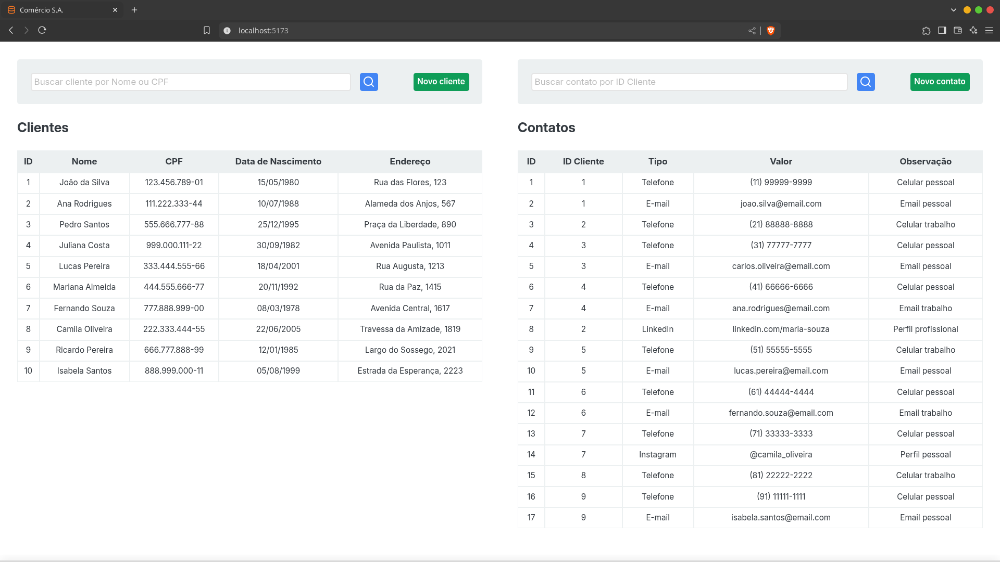

# Sistema de Gestão de Contatos - Frontend

Este repositório contém a implementação frontend do sistema de gestão de contatos desenvolvido para o desafio da Muralis. A interface de usuário permite gerenciar clientes e seus contatos de forma intuitiva.

## Tecnologias Utilizadas

- HTML
- CSS
- JavaScript
- React

## Estrutura do Projeto

```
├── public/
├── src/
│   ├── assets/
│   ├── components/
│   ├── hooks/
│   ├── pages/
│   ├── styles/
│   ├── utils/
│   ├── App.jsx
│   └── main.jsx
├── index.html
├── package.json
└── README.md
```

## Funcionalidades Implementadas

- Interface para cadastro, edição e exclusão de clientes
- Interface para cadastro, edição e exclusão de contatos
- Listagem de clientes e contatos com opções de filtro
- Visualização detalhada de clientes e contatos

## Instalação

1. Caso ainda não tenha clonado o repositório, execute o seguinte comando:

```bash
git clone https://github.com/thomasmfx/gestao-contatos-frontend.git
```

2. Navegue até o diretório do projeto:

```bash
cd gestao-contatos-frontend
```

## Execução

### Pré-requisitos

- Node.js instalado
- npm instalado

### Passos para Execução

1. Instale as dependências:

```bash
npm install
```

2. Se necessário, configure a URL da API no arquivo de configuração (src/utils/API.js):

```javascript
// Ajuste para o endereço onde o backend está rodando
const API_URL = 'http://localhost:8080/';
```

3. Inicie o servidor de desenvolvimento:

```bash
npm run dev
```

Pronto! A aplicação estará disponível na URL emitida pelo terminal, que por padrão é: `http://localhost:5173`

## Integração com o Backend

Este frontend está configurado para se comunicar com a API RESTful disponível no repositório [gestao-contatos-backend](https://github.com/thomasmfx/gestao-contatos-backend).

Para que o sistema funcione corretamente, certifique-se de que:

- O backend está em execução
- A URL base da API está configurada corretamente

## Screenshots


