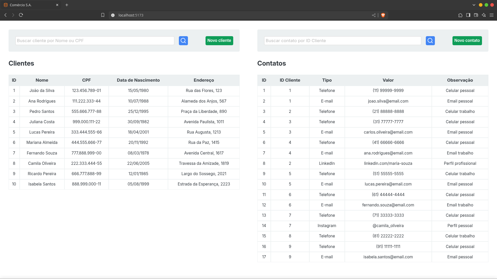

# Sistema de Gestão de Contatos - Frontend

Este repositório contém a implementação frontend do sistema de gestão de contatos desenvolvido para o desafio da Muralis. A interface de usuário permite gerenciar clientes e seus contatos de forma intuitiva.

## Tecnologias Utilizadas

- TypeScript
- Vue

## Estrutura do Projeto

```
├── public/
├── src/
│   ├── assets/
│   ├── components/
│   ├── composables/
│   ├── types/
│   ├── utils/
│   ├── views/
│   ├── App.vue
│   └── main.ts
├── Dockerfile
├── index.html
├── package.json
└── README.md
```

## Funcionalidades Implementadas

- Interface para cadastro, edição e exclusão de clientes
- Interface para cadastro, edição e exclusão de contatos
- Listagem de clientes e contatos com opções de filtro
- Visualização detalhada de clientes e contatos
- Notificações para dar feedbak às ações do usuário

## Configuração das variáveis de ambiente

Para estabelecer a conexão com o backend, basta criar um arquivo `.env` na raíz do projeto e definir uma única variável:

```
VITE_API_URL=http://localhost:7772
```

## Integração com o Backend

Este frontend está configurado para se comunicar com a API RESTful disponível no repositório [gestao-contatos-backend](https://github.com/thomasmfx/gestao-contatos-backend).

Para que o sistema funcione corretamente, certifique-se de que:

- O backend está em execução no mesmo ambiente Docker
- A URL base da API está configurada corretamente

## Screenshots


